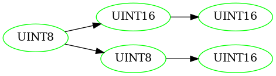
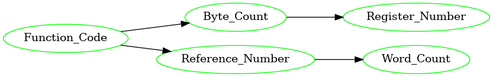
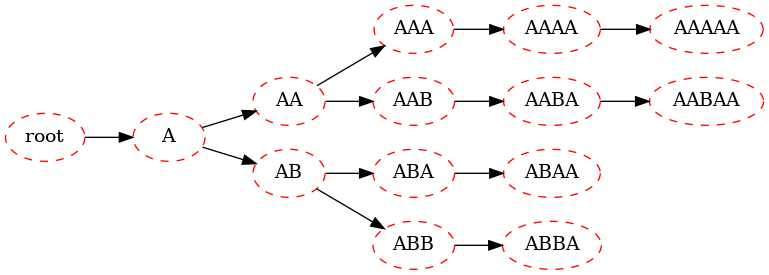
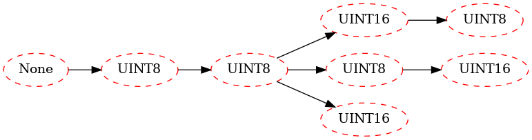

# APRE Benchmark Database
<!--- jupyter nbconvert --execute --to markdown README.ipynb* --->

This work has been published in the proceedings the 2024 9th International Conference on Communication, Image and Signal Processing ([CCISP](https://ieeexplore.ieee.org/abstract/document/10765535))
<details>
  <summary>BibTeX</summary>

```bibtex
@inproceedings{rohl_packet_2024,
	address = {Gold Coast, Australia},
	title = {Packet {Field} {Tree}: a {Hybrid} {Approach} for {Automated} {Protocol} {Reverse}-{Engineering}},
	copyright = {https://doi.org/10.15223/policy-029},
	isbn = {979-8-3503-5665-6},
	shorttitle = {Packet {Field} {Tree}},
	url = {https://ieeexplore.ieee.org/document/10765535/},
	doi = {10.1109/CCISP63826.2024.10765535},
	language = {en},
	urldate = {2025-05-01},
	booktitle = {2024 9th {International} {Conference} on {Communication}, {Image} and {Signal} {Processing} ({CCISP})},
	publisher = {IEEE},
	author = {Rohl, Alexander and Roughan, Matthew and White, Martin and Chambers, Alexander},
	month = nov,
	year = {2024},
	pages = {160--169},
}
```
</details> 

## Getting Started

```
git clone ...
cd apre-benchmark-database
touch setup.cfg
pip install -e. 
```


```python
%load_ext autoreload
%autoreload 2
from APREdatabase import *
from APREmeasures import *
from PacketFeatureTree import *
```

## Usage
### Mapping from Protocol names to Wireshark names


```python
ProtocolsDict = load_protocols()
```

### Parsing the PCAPs with Wireshark


```python
pcapfile = 'src/APREdatabase/Protocols/ModBus/ics-github/modbus_ics.pcap'
wireshark_name = ProtocolsDict['ModBus'] #modbus
c = ParseFileWithTShark(pcapfile, wireshark_name)
c.run_and_save()
```


### Retrieving data as X input and y output


```python
Protocol = 'ModBus'
FormatsDF = load_formats(ProtocolsDict, Protocol)
for capture_df in get_capture_csvs(Protocol):
    X, y_lengths, y_syntaxes, y_semantics = parse_df_to_X_y(capture_df, FormatsDF)
    break
X[0], y_lengths[0], y_syntaxes[0], y_semantics[0]
```

    Getting capture csvs for ModBus
    src/APREdatabase/Protocols/ModBus/ics-github/modbus_ics.csv
    src/APREdatabase/Protocols/ModBus/netplier/modbus_100.csv

    ((1223541953.927963, '0300010001'),
     [8, 16, 16],
     ['UINT8', 'UINT16', 'UINT16'],
     ['Function_Code', 'Reference_Number', 'Word_Count'])


### Display the True Field Tree


```python
TFT = FieldTree(y_syntaxes)
TFT.display()
```


    

    


```python
# Same can be done for semantics
FieldTree(y_semantics).display()
```


    

    


### Testing the Packet Field Tree


```python
pft1 = OneBytePFT(numeric_thresh=3, depth=10000)
pft1.fit(X)
pft1.show(attr='id')
```

    

    


```python
# load the byte-syntax-probability model
model_file = f'src/PacketFeatureTree/ByteLabelModels/clf_{Protocol}.pkl'
pft2 = LabelledPFT(pft1, model_file)
pft2.fit()
pft2.show()
```

    

    


### Measuring Perfection Score


```python
pred_types, pred_lengths = pft2.transform(X[:1000])
perfections = [PER(F(bit_lengths=T), F(bit_lengths=P)) for T,P in zip(y_lengths, pred_lengths)]
f'Perfection for first 1000 packets: {sum(perfections)/len(perfections)}'
```


    'Perfection for first 1000 packets: 0.6911764705882353'


### Measuring the PFT Score


```python
PN, TN, PND, TNI, score = FieldTreeScore(pft2.tree.children[0], TFT.tree)
f'Field Tree Score for {Protocol} is {score}: '
```

    'Field Tree Score for ModBus is 0.86: '


```python
PN, TN, PND, TNI
```

    (7, 5, 2, 0)


## Add Custom Dissection

Create a new folder in src/APREdatabase/Protocols.
Each capture should exist in a subfolder, paired with the capture csv.
The main protocol format should contain the formats csv

```
Protocols/
    ModBus/
        ics-github/
            modbus_ics.csv
            modbus_ics.pcap
        netplier/
            modbus_100.csv
            modbus_100.csv
        modbus_formats.csv
```

See ModBus example below


```python
import pandas as pd
pd.set_option('display.max_colwidth', None)
capture_df.head()
```


<div>
<style scoped>
    .dataframe tbody tr th:only-of-type {
        vertical-align: middle;
    }

    .dataframe tbody tr th {
        vertical-align: top;
    }

    .dataframe thead th {
        text-align: right;
    }
</style>
<table border="1" class="dataframe">
  <thead>
    <tr style="text-align: right;">
      <th></th>
      <th>Timestamp</th>
      <th>FormatID</th>
      <th>Bytes</th>
    </tr>
  </thead>
  <tbody>
    <tr>
      <th>0</th>
      <td>1.223542e+09</td>
      <td>7610892405297291280</td>
      <td>0300010001</td>
    </tr>
    <tr>
      <th>1</th>
      <td>1.223542e+09</td>
      <td>4396784460422726028</td>
      <td>03020000</td>
    </tr>
    <tr>
      <th>2</th>
      <td>1.223542e+09</td>
      <td>7610892405297291280</td>
      <td>0300000001</td>
    </tr>
    <tr>
      <th>3</th>
      <td>1.223542e+09</td>
      <td>4396784460422726028</td>
      <td>030241c8</td>
    </tr>
    <tr>
      <th>4</th>
      <td>1.223542e+09</td>
      <td>7610892405297291280</td>
      <td>0300010001</td>
    </tr>
  </tbody>
</table>
</div>


```python
FormatsDF.head()
```


<div>
<style scoped>
    .dataframe tbody tr th:only-of-type {
        vertical-align: middle;
    }

    .dataframe tbody tr th {
        vertical-align: top;
    }

    .dataframe thead th {
        text-align: right;
    }
</style>
<table border="1" class="dataframe">
  <thead>
    <tr style="text-align: right;">
      <th></th>
      <th>FormatID</th>
      <th>ListOfBitLengths</th>
      <th>ListOfSyntaxes</th>
      <th>ListOfSemantics</th>
    </tr>
  </thead>
  <tbody>
    <tr>
      <th>0</th>
      <td>76080666719832252</td>
      <td>[8, 16, 16]</td>
      <td>['UINT8', 'UINT16', 'UINT16']</td>
      <td>['Function_Code', 'Reference_Number', 'Word_Count']</td>
    </tr>
    <tr>
      <th>1</th>
      <td>6037985509206244978</td>
      <td>[8, 8, 16]</td>
      <td>['UINT8', 'UINT8', 'UINT16']</td>
      <td>['Function_Code', 'Byte_Count', 'Register_Number']</td>
    </tr>
    <tr>
      <th>2</th>
      <td>3616650787833225930</td>
      <td>[8, 16, 16, 8, 8]</td>
      <td>['UINT8', 'UINT16', 'UINT16', 'UINT8', 'BYTES']</td>
      <td>['Function_Code', 'Reference_Number', 'Bit_Count', 'Byte_Count', 'Data']</td>
    </tr>
    <tr>
      <th>3</th>
      <td>4793355977598292298</td>
      <td>[8, 16, 16]</td>
      <td>['UINT8', 'UINT16', 'UINT16']</td>
      <td>['Function_Code', 'Reference_Number', 'Bit_Count']</td>
    </tr>
    <tr>
      <th>4</th>
      <td>2239161636942362668</td>
      <td>[8, 16, 16, 8, 16]</td>
      <td>['UINT8', 'UINT16', 'UINT16', 'UINT8', 'BYTES']</td>
      <td>['Function_Code', 'Reference_Number', 'Bit_Count', 'Byte_Count', 'Data']</td>
    </tr>
  </tbody>
</table>
</div>


## Acknowledgements for Packet Captures 

UNSW IoT Analytics Traces: https://iotanalytics.unsw.edu.au/iottraces.html

4SICS. Geek Lounge ICS Lab (CS3STHLM).
download.netresec.com/pcap/4sics-2015, 2015.

CISA. Industrial Control Systems Network Protocol
Parsers (ICSNPP). github.com/cisagov/ICSNPP, 2020.

Gerald Combs. Wireshark. wiki.wireshark.org, 1998.

SMIA. Swedish Defence Research Agency Information
Warfare Lab. download.netresec.com/pcap/smia-2011,
2011.

I. Sharafaldin, A. H. Lashkari, S. Hakak, and A. A. Ghorbani. Developing realistic distributed denial of service
(DDoS) attack dataset and taxonomy. In 2019 International Carnahan Conference on Security Technology
(ICCST), pages 1–8, 2019.


```python

```
