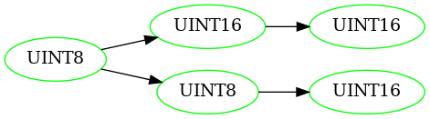
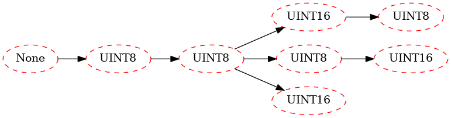

```python
%load_ext autoreload
%autoreload 2
from APREdatabase import *
from APREmeasures import *
from PacketFeatureTree import *
import pandas as pd
```


```python
ProtocolsDict = load_protocols(rel_to_root='../../')
p = 'ModBus'
ProtocolsDict[p]
```


    'modbus'


```python
FormatsDF = load_formats(ProtocolsDict, p, rel_to_root='../../')
for capture_df in get_capture_csvs(p, rel_to_root='../../'):
    X, y_lengths, y_syntaxes, y_semantics = parse_df_to_X_y(capture_df, FormatsDF)
    break

TFT = FieldTree(y_syntaxes)
TFT.display()
```

    Getting capture csvs for ModBus
    ../../src/APREdatabase/Protocols/ModBus/ics-github/modbus_ics.csv
    ../../src/APREdatabase/Protocols/ModBus/netplier/modbus_100.csv


    

    


```python
model_file = f'../../src/PacketFeatureTree/ByteLabelModels/clf_{p}.pkl'
pft1 = OneBytePFT(numeric_thresh=3, depth=10000)
pft1.fit(X[:1000])
pft1.show(attr='id')
# load the byte-syntax-probability model
pft2 = LabelledPFT(pft1, model_file)
pft2.fit()
pft2.show()
```

    id


    

    


    type


    

    


```python
PN, TN, PND, TNI, score = FieldTreeScore(pft2.tree.children[0], TFT.tree) #dont include the 'root' node
f'Field Tree Score for {p} is {score}: {PN, TN, PND, TNI=}'
```

    dist=2.0


    'Field Tree Score for ModBus is 0.86: PN, TN, PND, TNI=(7, 5, 2, 0)'


$$\textbf{Com}(\mathcal{T}, \mathcal{P}) = \frac{|\{ P \in \mathcal{P} : P \sqsubset \mathcal{T}\}|}{|\mathcal{P}|} $$

$$\textbf{Con}(\mathcal{T}, \mathcal{P}) = \frac{|\{ T \in \mathcal{T} : T \sqsubset \mathcal{P}\}|}{|\mathcal{T}|} $$

$$\textbf{Cor}(\mathcal{T}, \mathcal{P}) = \frac{|\{ P\in \mathcal{P} : P \sqsubset \mathcal{T} \} \cup \{P \in \mathcal{P} : \exists T \in \mathcal{T} : T \subseteq P \}|}{|\mathcal{P}|} $$

$$\textbf{Per}(\mathcal{T}, \mathcal{P}) = \frac{|\{ P\in \mathcal{P} : P \in \mathcal{T}\}|}{|\mathcal{P}|} $$


$$\textbf{FMS}(T, P) = \text{ exp} \left( - \left( \frac{|T|-|P|}{|T^b|} \right) ^2 \right) \times \frac{1}{|T^b|}   \displaystyle\sum_{t \in T^b} \text{exp} \left( - \left( \frac{\delta_{tP}}{\gamma } \right) ^2 \right) \\ $$

$\delta_{tP} := \text{ min}_{p \in P^b} \{ |p - t| \}$.

$$\textbf{WAR}(\hat{\mathcal{T}}, \hat{\mathcal{P}}) = \frac{|\{i \in [0,\dots,\mathcal{P}^{(l)}] : t_i=p_i\}|}{|\hat{\mathcal{P}}|} $$


$$\textbf{PS}_n(\hat{T}, \hat{P}) = \frac{\sum_{s \in G_n(\hat{P})} \min (C(s, \hat{P}), C(s, \hat{T}))}{\sum_{s \in G_n(\hat{P})} C(s, \hat{P})} $$


$$ \textbf{BLEU}_k(\hat{T}, \hat{P})=\exp \left[\min \left(0,1-\frac{|\hat{T}|}{|\hat{P}|}\right)\right] \prod_{n=1}^k \textbf{PS}_n(\hat{T}, \hat{P})^{1 / 2^n} $$


$$ \textbf{Lev}(\hat{T}, \hat{P}) = \begin{cases}
    |\hat{T}| & \text{if } |\hat{P}| = 0 \\
    |\hat{P}| & \text{if } |\hat{T}| = 0 \\
    \textbf{Lev}(\{t_2, \dots \}, \{p_2, \dots\}) & \text{if } t_1 = p_1 \\
    1 + \text{min} \begin{cases}
        \textbf{Lev}(\{t_2, \dots \}, \hat{P}) \\
        \textbf{Lev}(\hat{T}, \{p_2, \dots\})\\
        \textbf{Lev}(\{t_2, \dots \}, \{p_2, \dots\})
    \end{cases}
        & \text{otherwise}
\end{cases} $$

$\textbf{LevScore}(\hat{T}, \hat{P}) = 1 - \frac{\textbf{Lev}(\hat{T}, \hat{P})}{max(|\hat{T}|, |\hat{P}|)}$


```python
# Exact single-field match
cases1 = [
    [(0,8),(0,8)],
    [(0,4,8),(0,4,8)],
    [tuple(range(8)), tuple(range(8))]
]

# One true field split in two
cases2 = [
    [(0,8),(0,1,8)],
    [(0,8),(0,2,8)],
    [(0,8),(0,4,8)]
]

# One true field split into many single-length fields
cases3 = [
    [(0,4),(0,1,2,3,4)],
    [(0,8),tuple(range(9))],
    [(0,16),tuple(range(17))]
    ]

# Two true fields covered by a one predicted field
cases4 = [
    [(0,1,8),(0,8)],
    [(0,2,8),(0,8)],
    [(0,4,8),(0,8)]
    ]

# Many single-length true fields covered by one predicted field
cases5 = [
    [(0,1,2,3,4), (0,4)],
    [tuple(range(9)), (0,8)],
    [tuple(range(17)), (0,16)]
    ]

# Staggered fields
cases6 = [
    [(0,2,4,6,8),   (0,1,3,5,7,8)],
    [(0,4,8,12,16), (0,1,5,9,13,16)],
    [(0,8,16,24,32), (0,1,9,17,25,32)]
]
```


```python
D = {}
D['Case'] = [item for row in [cases1, cases2, cases3, cases4, cases5, cases6] for item in row]
Ts = [F(case[0]) for case in D['Case']]
Ps = [F(case[1]) for case in D['Case']]
global Ts
global Ps

def apply_fn(f):
    return [round(f(T, P), 2) for T, P in zip(Ts, Ps)]

D['Com'] = apply_fn(COM)
D['Con'] = apply_fn(CON)
D['Cor'] = apply_fn(COR)
D['Per'] = apply_fn(PER)
D['FMS'] = apply_fn(FMS)
D['WAR'] = apply_fn(WAR)
D['PS2'] = apply_fn(lambda T, P: PS_n(T, P, n=2))
D['PS4'] = apply_fn(lambda T, P: PS_n(T, P, n=4))
D['PS8'] = apply_fn(lambda T, P: PS_n(T, P, n=8))
D['BLEU'] = apply_fn(bleu)
D['Lev'] = apply_fn(Lev)

df = pd.DataFrame(data=D)
df
```


<div>
<style scoped>
    .dataframe tbody tr th:only-of-type {
        vertical-align: middle;
    }

    .dataframe tbody tr th {
        vertical-align: top;
    }

    .dataframe thead th {
        text-align: right;
    }
</style>
<table border="1" class="dataframe">
  <thead>
    <tr style="text-align: right;">
      <th></th>
      <th>Case</th>
      <th>Com</th>
      <th>Con</th>
      <th>Cor</th>
      <th>Per</th>
      <th>FMS</th>
      <th>WAR</th>
      <th>PS2</th>
      <th>PS4</th>
      <th>PS8</th>
      <th>BLEU</th>
      <th>Lev</th>
    </tr>
  </thead>
  <tbody>
    <tr>
      <th>0</th>
      <td>[(0, 8), (0, 8)]</td>
      <td>1.0</td>
      <td>1.0</td>
      <td>1.0</td>
      <td>1.0</td>
      <td>1.00</td>
      <td>1.00</td>
      <td>1.00</td>
      <td>1.00</td>
      <td>1.00</td>
      <td>1.00</td>
      <td>1.00</td>
    </tr>
    <tr>
      <th>1</th>
      <td>[(0, 4, 8), (0, 4, 8)]</td>
      <td>1.0</td>
      <td>1.0</td>
      <td>1.0</td>
      <td>1.0</td>
      <td>1.00</td>
      <td>1.00</td>
      <td>1.00</td>
      <td>1.00</td>
      <td>1.00</td>
      <td>1.00</td>
      <td>1.00</td>
    </tr>
    <tr>
      <th>2</th>
      <td>[(0, 1, 2, 3, 4, 5, 6, 7), (0, 1, 2, 3, 4, 5, ...</td>
      <td>1.0</td>
      <td>1.0</td>
      <td>1.0</td>
      <td>1.0</td>
      <td>1.00</td>
      <td>1.00</td>
      <td>1.00</td>
      <td>1.00</td>
      <td>1.00</td>
      <td>1.00</td>
      <td>1.00</td>
    </tr>
    <tr>
      <th>3</th>
      <td>[(0, 8), (0, 1, 8)]</td>
      <td>1.0</td>
      <td>0.0</td>
      <td>0.0</td>
      <td>0.0</td>
      <td>0.78</td>
      <td>0.89</td>
      <td>0.83</td>
      <td>0.75</td>
      <td>0.00</td>
      <td>0.85</td>
      <td>0.91</td>
    </tr>
    <tr>
      <th>4</th>
      <td>[(0, 8), (0, 2, 8)]</td>
      <td>1.0</td>
      <td>0.0</td>
      <td>0.0</td>
      <td>0.0</td>
      <td>0.78</td>
      <td>0.89</td>
      <td>0.67</td>
      <td>0.60</td>
      <td>0.00</td>
      <td>0.75</td>
      <td>0.91</td>
    </tr>
    <tr>
      <th>5</th>
      <td>[(0, 8), (0, 4, 8)]</td>
      <td>1.0</td>
      <td>0.0</td>
      <td>0.0</td>
      <td>0.0</td>
      <td>0.78</td>
      <td>0.89</td>
      <td>0.67</td>
      <td>0.33</td>
      <td>0.00</td>
      <td>0.74</td>
      <td>0.91</td>
    </tr>
    <tr>
      <th>6</th>
      <td>[(0, 4), (0, 1, 2, 3, 4)]</td>
      <td>1.0</td>
      <td>0.0</td>
      <td>0.0</td>
      <td>0.0</td>
      <td>0.11</td>
      <td>0.40</td>
      <td>0.00</td>
      <td>0.00</td>
      <td>0.00</td>
      <td>0.63</td>
      <td>0.67</td>
    </tr>
    <tr>
      <th>7</th>
      <td>[(0, 8), (0, 1, 2, 3, 4, 5, 6, 7, 8)]</td>
      <td>1.0</td>
      <td>0.0</td>
      <td>0.0</td>
      <td>0.0</td>
      <td>0.00</td>
      <td>0.22</td>
      <td>0.00</td>
      <td>0.00</td>
      <td>0.00</td>
      <td>0.47</td>
      <td>0.59</td>
    </tr>
    <tr>
      <th>8</th>
      <td>[(0, 16), (0, 1, 2, 3, 4, 5, 6, 7, 8, 9, 10, 1...</td>
      <td>1.0</td>
      <td>0.0</td>
      <td>0.0</td>
      <td>0.0</td>
      <td>0.00</td>
      <td>0.12</td>
      <td>0.00</td>
      <td>0.00</td>
      <td>0.00</td>
      <td>0.34</td>
      <td>0.55</td>
    </tr>
    <tr>
      <th>9</th>
      <td>[(0, 1, 8), (0, 8)]</td>
      <td>0.0</td>
      <td>1.0</td>
      <td>0.0</td>
      <td>0.0</td>
      <td>0.83</td>
      <td>0.89</td>
      <td>1.00</td>
      <td>1.00</td>
      <td>0.00</td>
      <td>0.94</td>
      <td>0.91</td>
    </tr>
    <tr>
      <th>10</th>
      <td>[(0, 2, 8), (0, 8)]</td>
      <td>0.0</td>
      <td>1.0</td>
      <td>0.0</td>
      <td>0.0</td>
      <td>0.71</td>
      <td>0.89</td>
      <td>0.80</td>
      <td>1.00</td>
      <td>0.00</td>
      <td>0.85</td>
      <td>0.91</td>
    </tr>
    <tr>
      <th>11</th>
      <td>[(0, 4, 8), (0, 8)]</td>
      <td>0.0</td>
      <td>1.0</td>
      <td>0.0</td>
      <td>0.0</td>
      <td>0.60</td>
      <td>0.89</td>
      <td>0.80</td>
      <td>0.67</td>
      <td>0.00</td>
      <td>0.87</td>
      <td>0.91</td>
    </tr>
    <tr>
      <th>12</th>
      <td>[(0, 1, 2, 3, 4), (0, 4)]</td>
      <td>0.0</td>
      <td>1.0</td>
      <td>0.0</td>
      <td>0.0</td>
      <td>0.55</td>
      <td>0.40</td>
      <td>0.00</td>
      <td>0.00</td>
      <td>0.00</td>
      <td>0.63</td>
      <td>0.67</td>
    </tr>
    <tr>
      <th>13</th>
      <td>[(0, 1, 2, 3, 4, 5, 6, 7, 8), (0, 8)]</td>
      <td>0.0</td>
      <td>1.0</td>
      <td>0.0</td>
      <td>0.0</td>
      <td>0.27</td>
      <td>0.22</td>
      <td>0.00</td>
      <td>0.00</td>
      <td>0.00</td>
      <td>0.47</td>
      <td>0.59</td>
    </tr>
    <tr>
      <th>14</th>
      <td>[(0, 1, 2, 3, 4, 5, 6, 7, 8, 9, 10, 11, 12, 13...</td>
      <td>0.0</td>
      <td>1.0</td>
      <td>0.0</td>
      <td>0.0</td>
      <td>0.12</td>
      <td>0.12</td>
      <td>0.00</td>
      <td>0.00</td>
      <td>0.00</td>
      <td>0.34</td>
      <td>0.55</td>
    </tr>
    <tr>
      <th>15</th>
      <td>[(0, 2, 4, 6, 8), (0, 1, 3, 5, 7, 8)]</td>
      <td>0.4</td>
      <td>0.0</td>
      <td>0.0</td>
      <td>0.0</td>
      <td>0.83</td>
      <td>0.22</td>
      <td>0.75</td>
      <td>0.50</td>
      <td>0.00</td>
      <td>0.76</td>
      <td>0.79</td>
    </tr>
    <tr>
      <th>16</th>
      <td>[(0, 4, 8, 12, 16), (0, 1, 5, 9, 13, 16)]</td>
      <td>0.4</td>
      <td>0.0</td>
      <td>0.0</td>
      <td>0.0</td>
      <td>0.83</td>
      <td>0.59</td>
      <td>0.92</td>
      <td>0.86</td>
      <td>0.67</td>
      <td>0.92</td>
      <td>0.86</td>
    </tr>
    <tr>
      <th>17</th>
      <td>[(0, 8, 16, 24, 32), (0, 1, 9, 17, 25, 32)]</td>
      <td>0.4</td>
      <td>0.0</td>
      <td>0.0</td>
      <td>0.0</td>
      <td>0.83</td>
      <td>0.79</td>
      <td>0.95</td>
      <td>0.95</td>
      <td>0.92</td>
      <td>0.96</td>
      <td>0.92</td>
    </tr>
  </tbody>
</table>
</div>


